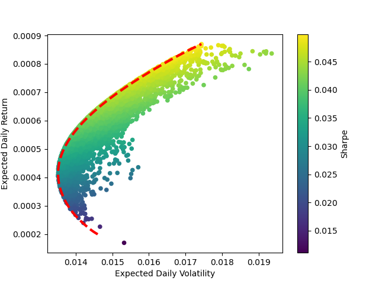

# markowitz
Downloads Yahoo Finance data for several stocks and plots the Markowitz efficient frontier for two (markowitz.py)/ four (markowitz2.py) stocks. 
In the latter case, uses numerical minimization to find the efficient frontier.

